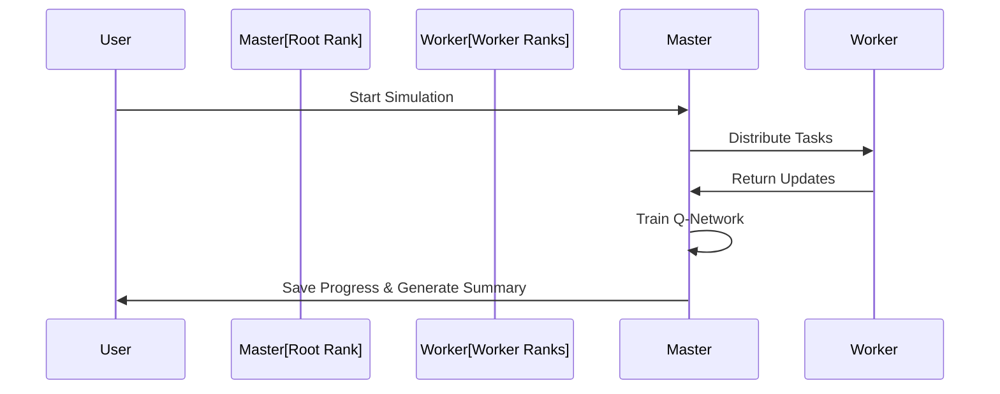

# WorldSim5 - Distributed World Simulation with Reinforcement Learning

Welcome to **WorldSim5**, an advanced, MPI-powered world simulation featuring dynamic entities, evolving global knowledge, and reinforcement learning (DQN) driven decision-making. The simulation runs across multiple distributed nodes using `mpi4py` and `PyTorch`.

---

## **📊 System Architecture Overview**

```mermaid
graph TD
A[Entities] --> B[Global Knowledge]
A --> C[Resource Management]
A --> D[Action Selection]
D --> E[Q-Network (DQN)]
E --> F[Replay Buffer]
F --> G[Training & Backpropagation]
E --> H[Optimized Action]
```

---

## **🏗️ Key Components**

### **1. MPI Distributed System**
- **Parallel Execution:** Managed using `mpi4py`
- **Ranks & Roles:** Each process has a unique rank, enabling distributed tasks.

### **2. Entity Management**
- **Attributes:** Health, resources, intelligence, and skills.
- **Roles:** Entities adapt roles dynamically (Explorer, Trader, Leader, etc.).
- **Actions:** Gather, build, craft, explore, trade, and even initiate space flight.

### **3. Knowledge System**
- **Discovery Mechanism:** Entities perform experiments, resulting in new discoveries.
- **Global Knowledge:** Shared among all entities, influencing global progress.

### **4. Reinforcement Learning (DQN)**
- **Model:** A neural network predicts action Q-values.
- **Replay Buffer:** Stores experiences for learning.
- **Training Loop:** Backpropagation updates the Q-network.

### **5. Event Logging & Persistence**
- **Event Logs:** Logs important events in a persistent file.
- **Persistence:** Saves the world, global knowledge, and simulation state.

---

## **🚀 Simulation Workflow**



---

## **🌍 Key Features**
- **Scalability:** Run across multiple nodes.
- **Emergent Behavior:** Unexpected developments driven by complex interactions.
- **Persistence & Continuity:** Load and save the evolving world state.

---

## **📁 File Management**
- `world_save.json`: Stores entity states.
- `global_knowledge.json`: Contains collective knowledge.
- `model_weights.pt`: Saves DQN model weights.
- `state.json`: Tracks simulation progress.

---

## **📦 How to Run**
1. **Install Dependencies:**
   ```bash
   pip install mpi4py torch
   ```

2. **Run the Simulation:**
   ```bash
   mpirun -np <num_processes> python WorldSim5.py
   ```

---

## **🔍 Future Development Ideas**
- Expand the simulation with deeper economic, political, and social interactions.
- Add more complex neural network architectures.
- Integrate visual dashboards for real-time monitoring.

---

**Developed by:** [Your Name]  
**License:** MIT
