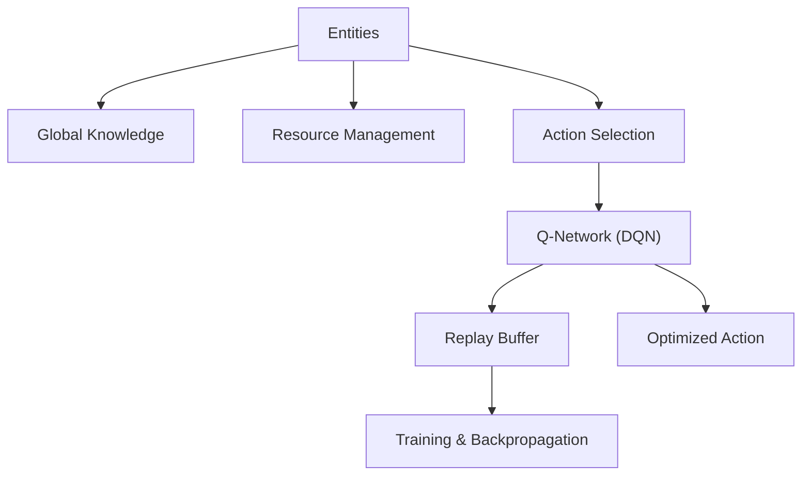
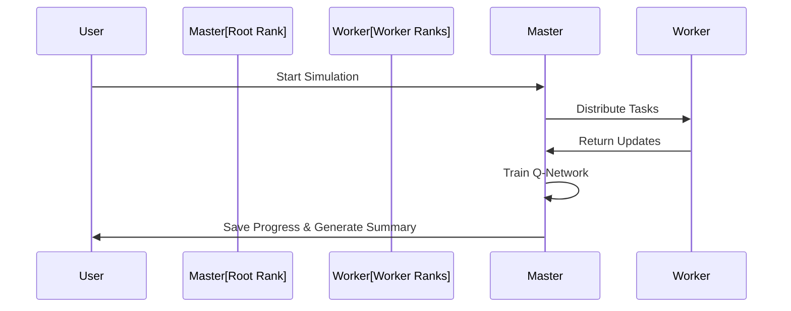

# WorldSim5 - Distributed World Simulation with Reinforcement Learning

Welcome to **WorldSim5**, an advanced, MPI-powered world simulation featuring dynamic entities, evolving global knowledge, and reinforcement learning (DQN) driven decision-making. The simulation runs across multiple distributed nodes using `mpi4py` and `PyTorch`.

---

## **📊 System Architecture Overview**



---

## **🏗️ Key Components**

### **1. MPI Distributed System**
- **Parallel Execution:** Managed using `mpi4py`
- **Ranks & Roles:** Each process has a unique rank, enabling distributed tasks.

### **2. Entity Management**
- **Attributes:** Health, resources, intelligence, and skills.

- **Roles:** Entities adapt roles dynamically (Explorer, Trader, Leader, etc.).

- **Actions:** Gather, build, craft, explore, trade, and even initiate space flight.

- **Behavior:** Entities can evolve based on their intelligence, global knowledge, and resource gains.


### **3. Knowledge System**
- **Discovery Mechanism:** Entities perform experiments, resulting in new discoveries.

- **Global Knowledge:** Shared among all entities, influencing global progress.

- Example Knowledge Items:

  - **Advanced Agriculture:** Boosts food gathering.

  - **Space Flight:** Enables advanced technological leaps.

  - **Town Management:** Allows founding of organized towns.


### **4. Reinforcement Learning (DQN)**
- **Model:** A neural network predicts action Q-values based on entity states.

- **Replay Buffer:** Stores experiences for learning.

- **Training Loop:** Backpropagation optimizes the Q-network to improve decision-making.

### **5. Event Logging & Persistence**
- **Event Logs:** Logs significant events in a persistent file.

- **Persistence:** Saves the world, global knowledge, and simulation state.

- Example Events:

  - New Knowledge Discovered

  - Entities Founding Homes and Towns

  - Random Major Events: Natural Disasters, Wars, or Trade Routes.


---

## **🚀 Simulation Workflow**



---

## **🌍 Key Features**
- **Scalability:** Run simulations across multiple nodes for performance and scale.

- **Emergent Behavior:** Entities evolve roles, form alliances, and adapt based on the simulation state.

- **Persistence & Continuity:** Save and reload the world, ensuring long-term simulation growth.


---

## **📁 File Management**
- `world_save.json`: Stores entity states.

- `global_knowledge.json`: Contains collective knowledge.

- `model_weights.pt`: Saves DQN model weights.

- `state.json`: Tracks simulation progress.


---

## **📦 How to Run**
1. **Install Dependencies:**
   ```bash
   pip install mpi4py torch
   ```

2. **Run the Simulation:**
   ```bash
   mpirun -np <num_processes> python WorldSim5.py
   ```

3. **Simulation Progress:** Look for log files and JSON outputs to monitor entity progression and global knowledge.

---

## **📊 Outputs and Examples**

### **Sample Event Logs**
```
[YEAR 100] Entity_5 discovered 'advanced_agriculture' - Improved farming techniques!
[YEAR 250] Natural disaster occurred near (30, -45), causing severe damage.
[YEAR 500] Entity_20 founded a new town: Town_Entity_20 at (-10, 20).
```

### **Sample Entity State**
```json
{
  "name": "Entity_5",
  "role": "Explorer",
  "health": 85,
  "location": [20, -10],
  "resources": {"food": 120, "gold": 80, "influence": 40, "crafted_goods": 5},
  "intelligence": 70,
  "skills": ["Advanced_Combat"],
  "local_knowledge": ["advanced_agriculture"],
  "home": null,
  "town": null
}
```

---

## **🔍 Future Development Ideas**
- Add visual dashboards to track simulation progression in real time.

- Introduce deeper economic, political, and social simulation models.

- Experiment with more advanced neural networks to optimize entity behavior.

---

**Developed by:** [Your Name]  
**License:** MIT
