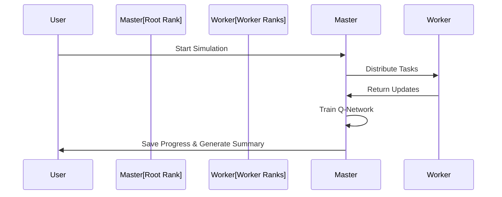

# World_Simulator10 - Realistic Life Progression Simulation

Welcome to **World_Simulator10**, a distributed, MPI-powered simulation that realistically models the progression of entities through various life stages. This enhanced version ensures entities develop through survival, civilization-building, industrialization, and modern eras before advancing to space exploration.

---

## **📊 System Architecture Overview**

```mermaid
graph TD
A[Entities] --> B[Global Knowledge]
A --> C[Life Stages Progression]
A --> D[Action Selection]
D --> E[Q-Network (DQN)]
E --> F[Replay Buffer]
F --> G[Training & Backpropagation]
E --> H[Optimized Action]
```

---

## **🏗️ Key Components**

### **1. Life Progression Stages**
1. **Basic Survival:**
   - Gathering food, water, and basic resources.
   - Building shelters and forming small communities.

2. **Early Civilization:**
   - Establishing towns and villages.
   - Learning farming, crafting, and basic trade.

3. **Technological Expansion:**
   - Constructing roads, schools, and hospitals.
   - Harnessing electric power and steam engines.

4. **Industrial Age:**
   - Developing transportation (trains, planes, cars).
   - Creating advanced infrastructure (factories, cities).

5. **Modern Era:**
   - Establishing governments, law enforcement, and public services.
   - Advancing in medicine, information technology, and global connectivity.

6. **Space Age:**
   - Researching space technology and AI.
   - Establishing space programs and advanced facilities.

### **2. MPI Distributed System**
- **Parallel Execution:** Managed using `mpi4py` for distributed workloads.
- **Ranks & Roles:** Each process handles a subset of entities.

### **3. Reinforcement Learning (DQN)**
- **Model:** A neural network predicts Q-values based on entity states.
- **Replay Buffer:** Stores experiences for learning.
- **Training Loop:** Optimizes the Q-network to improve decision-making.

### **4. Event Logging & Persistence**
- **Event Logs:** Logs key events (e.g., disasters, discoveries, city expansions).
- **Persistence:** Saves world state, global knowledge, and simulation status.

---

## **🚀 Simulation Workflow**



---

## **📦 How to Run**
1. **Install Dependencies:**
   ```bash
   pip install mpi4py torch
   ```

2. **Run the Simulation:**
   ```bash
   mpirun -np <num_processes> python World_Simulator10.py
   ```

---

## **📊 Outputs and Examples**

### **Sample Event Logs**
```
[YEAR 10] Entity_200 founded a new village at (-20, 35).
[YEAR 50] Entity_500 discovered 'Electric Power' - Revolutionizing infrastructure.
[YEAR 120] Entity_1000 built a train network connecting major towns.
[YEAR 200] Entity_1500 initiated a space program, expanding to new frontiers.
[YEAR 250] Entity_2000 founded a global university, boosting education.
```

### **Sample Entity State**
```json
{
  "name": "Entity_500",
  "role": "Builder",
  "health": 90,
  "location": [10, -5],
  "resources": {"food": 200, "gold": 150, "influence": 80, "crafted_goods": 10},
  "intelligence": 120,
  "skills": ["Advanced_Combat", "Infrastructure"],
  "local_knowledge": ["electric_power", "steam_engine"],
  "home": "Home_Entity_500",
  "town": "Town_500"
}
```

---

## **🔍 Key Features**
- **Realistic Progression:** Entities advance through structured life stages.
- **Scalability:** Runs efficiently across distributed nodes.
- **Emergent Behavior:** Entities adapt based on knowledge, roles, and resources.
- **Dynamic Expansion:** Towns grow into cities, with governments and infrastructure.
- **Persistent World:** Save and reload to continue simulation growth.

---

## **📁 File Management**
- `world_save.json`: Stores entity states.
- `global_knowledge.json`: Contains collective knowledge.
- `model_weights.pt`: Saves DQN model weights.
- `state.json`: Tracks simulation progress.

---

**Developed by:** [Your Name]  
**License:** MIT
